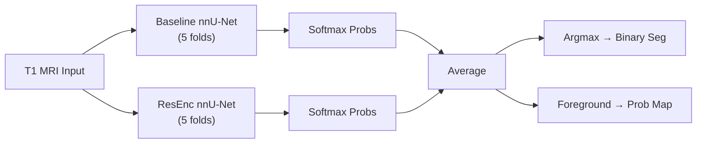

# ISLES 2026 Docker Submission — Walkthrough

## What Was Created

All files are in the `isles26_docker/` folder.

### File Overview

| File | Purpose |
|------|---------|
| [Dockerfile](Dockerfile) | Docker build config — PyTorch 2.13 + CUDA 12.6 base, installs nnU-Net v2 |
| [app.py](app.py) | FastAPI HTTP server (`/health` + `/invoke` on port 4743) |
| [inference.py](inference.py) | **Core logic** — loads both models, ensembles softmax, outputs seg + prob map |
| [requirements.txt](requirements.txt) | Python dependencies (nnunetv2, SimpleITK, scikit-image, fastapi, uvicorn) |
| [custom_trainers/logging_trainer.py](custom_trainers/logging_trainer.py) | Custom `nnUNetTrainerWithLogging` class (copied from nnunetv2 install) |
| [do_build.sh](do_build.sh) | Builds the Docker image |
| [do_test_run.sh](do_test_run.sh) | Full local test — builds, starts server, calls /invoke, collects output |
| [do_save.sh](do_save.sh) | Saves Docker image as `.tar.gz` for Grand Challenge upload |
| [copy_weights.ps1](copy_weights.ps1) | PowerShell script to copy model weights from training results |
| [model/README.md](model/README.md) | Documents the required model directory structure |

### Ensemble Architecture



---

## Step-by-Step Guide

### Step 1: Copy Model Weights

Run the PowerShell script to copy all checkpoints (~5.0 GB total across both models):

```powershell
cd c:\Users\Admin\Desktop\meghpatel\isles26\isles26_docker
powershell -ExecutionPolicy Bypass -File .\copy_weights.ps1
```

This copies from your training results at `data\nnunet_results\Dataset001_ISLES26\` into `isles26_docker\model\` with the correct folder structure:

```
model/Dataset001_ISLES26/
├── nnUNetTrainer__nnUNetPlans__3d_fullres/        (~240 MB × 5 folds)
│   ├── fold_0/checkpoint_final.pth
│   ├── fold_1/checkpoint_final.pth
│   ├── fold_2/checkpoint_final.pth
│   ├── fold_3/checkpoint_final.pth
│   ├── fold_4/checkpoint_final.pth
│   ├── dataset.json
│   ├── plans.json
│   ├── postprocessing.pkl
│   └── postprocessing.json
└── nnUNetTrainerWithLogging__nnUNetResEncUNetMPlans__3d_fullres/  (~780 MB × 5 folds)
    ├── fold_0/checkpoint_final.pth ... fold_4/
    ├── dataset.json
    ├── plans.json
    ├── postprocessing.pkl
    └── postprocessing.json
```

---

### Step 2: Place a Test MRI Scan

A sample test scan (`sub-r001s001_ses-0001_run-1_T1w.nii.gz`) is already placed in:
`isles26_docker/test/input/interf0/images/t1-brain-mri/`

To test on other scans, place any `.nii.gz` T1 brain MRI there:

```powershell
# Example:
copy "data\nnunet_raw\Dataset001_ISLES26\imagesTr\r001s001_0000.nii.gz" `
     "isles26_docker\test\input\interf0\images\t1-brain-mri\sub-r001s001_ses-0001_run-1_T1w.nii.gz"
```

> [!NOTE]
> For the Preliminary Evaluation phase, Grand Challenge will test on `sub-r001s001` and `sub-soop0468`.

---

### Step 3: Build the Docker Image

> [!IMPORTANT]
> Make sure **Docker Desktop** is running.

From a **WSL/bash** terminal (or Git Bash):

```bash
cd isles26_docker
bash do_build.sh
```

Or equivalently in PowerShell:

```powershell
docker build --platform=linux/amd64 --tag "isles26-ensemble-algorithm" "c:\Users\Admin\Desktop\meghpatel\isles26\isles26_docker"
```

---

### Step 4: Test Locally

Run the full end-to-end test:

```bash
cd isles26_docker
bash do_test_run.sh
```

This will:
1. Build the Docker image
2. Start the container and poll `/health` until ready
3. Call `POST /invoke` to run inference
4. Collect outputs to `test/output/interf0/`

**Check the outputs:**

```bash
ls test/output/interf0/images/stroke-lesion-segmentation/   # Binary mask (.nii.gz)
ls test/output/interf0/images/lesion-probability-map/        # Probability map (.nii.gz)
```

---

### Step 5: Save for Grand Challenge Upload

```bash
cd isles26_docker
bash do_save.sh
```

This creates `isles26-ensemble-algorithm.tar.gz`.

**Create the model tarball** (from WSL/bash):

```bash
cd isles26_docker/model
tar -czf ../model.tar.gz .
```

---

### Step 6: Upload to Grand Challenge

1. **Upload Docker image:**
   - Go to your algorithm page on Grand Challenge
   - Upload `isles26-ensemble-algorithm.tar.gz` as a new Container

2. **Upload model weights:**
   - Go to **Your algorithm → Models**
   - Upload `model.tar.gz`
   - Grand Challenge extracts it to `/opt/ml/model/` inside the container at runtime

3. **Submit to Preliminary Evaluation** (sanity check):
   - You get 2 attempts per day
   - Tests on `sub-r001s001` and `sub-soop0468`
   - **Request a GPU** (the 10-fold ensemble will exceed the 10-minute CPU limit)

4. **After preliminary passes → Submit to Final Test Phase** (1 attempt only)

---

## Key Design Decisions

| Decision | Rationale |
|----------|-----------|
| `checkpoint_final.pth` | Standard nnU-Net convention for ensembled inference |
| Post-processing | Included `postprocessing.pkl` loading & application to binary segmentation |
| Softmax averaging | Class probability averaging across both models (10 folds total) |
| `save_probabilities=True` | Required to get softmax outputs from each model for ensembling |
| Dynamic trainer path in Dockerfile | Automatically installs custom trainer into nnunetv2 package at build time |
| GPU requested | 10 models × full 3D volumes = CPU would exceed the 10-minute limit |
